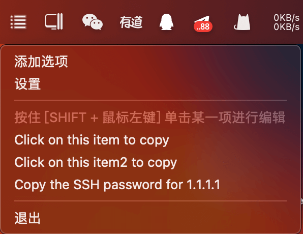

# QuickPaste
<table>
    <tr>
        <td>
            
        </td>
        <td>
             QuickPaste is a lightweight and cross platform clipboard management tool designed to improve work efficiency. This software allows users to easily add, manage, and access commonly used custom clipboard content. Through simple click operations, QuickPaste can pop up a shortcut paste menu from the system taskbar, allowing users to quickly select and paste text fragments or code. At runtime, QuickPaste will be hidden in the system taskbar, not interfering with your workflow, providing a clean and non-interference user experience. Whether you are a programmer, writer, or data analyst, QuickPaste is a powerful assistant for optimizing your workflow and saving time.
        </td>
  </tr>
</table>

## COMPILE

1. Download source code

```
git clone https://github.com/EvilGenius-dot/QuickPaste.git
```

2. Run in the source directory

```
npm install
```

or

```
pnpm install
```

3. Building binary executable files for different platforms

windows

```
npm run dist -- -w
```

macos

```
npm run dist -- -m
```

debug

```
npm run start
```

After the program starts, you can see the program icon in the taskbar.